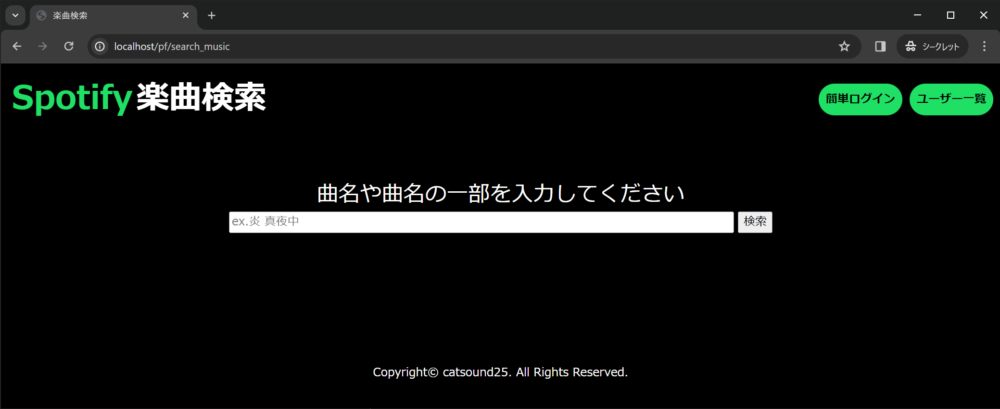
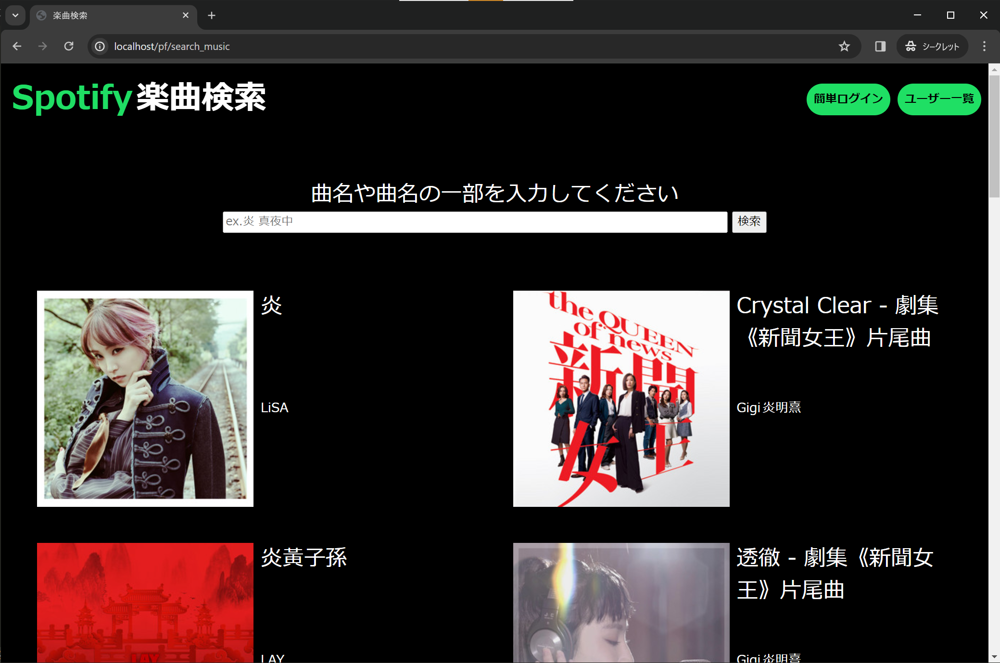
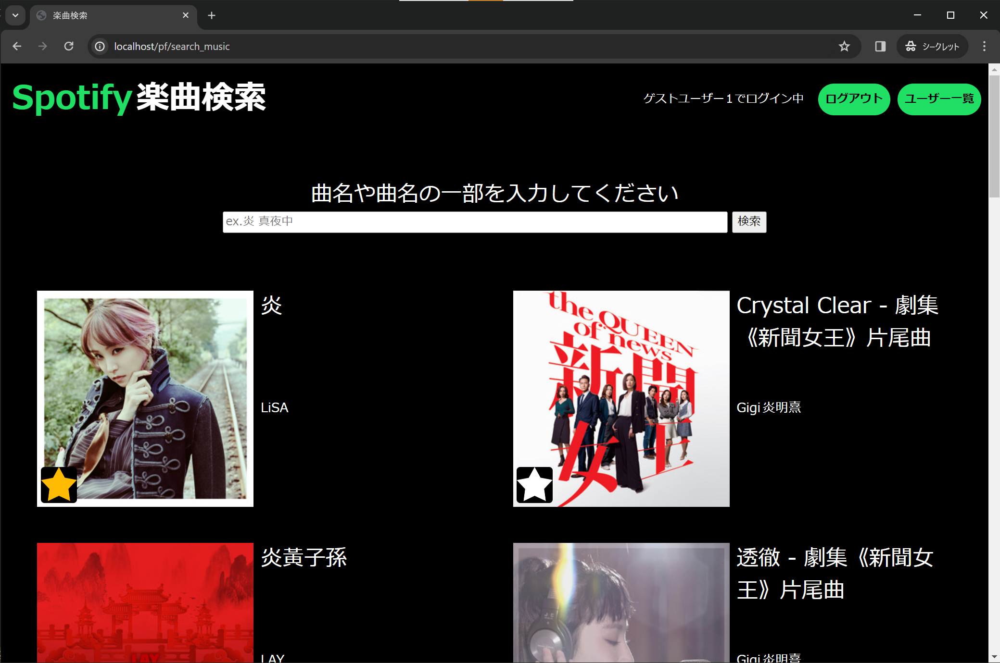
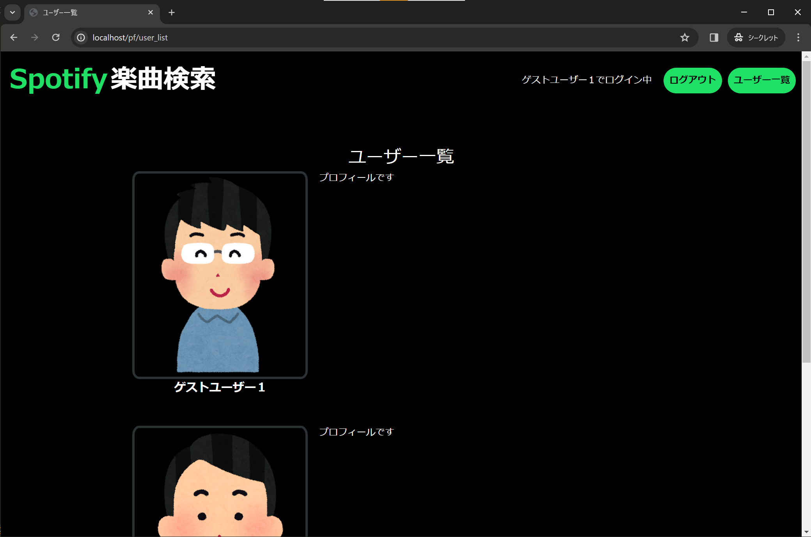
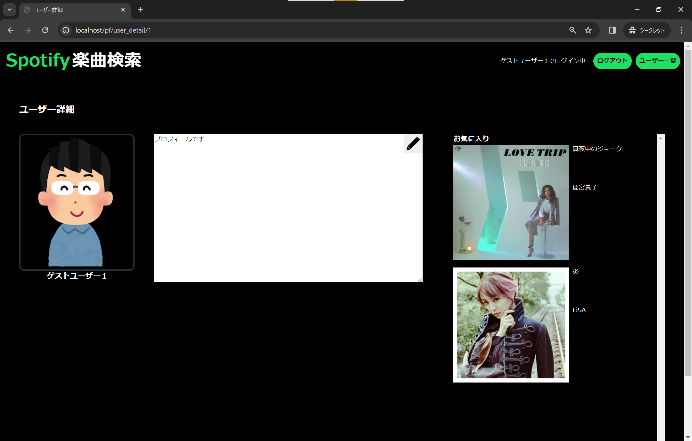

# Spotify楽曲検索

[SpotifyAPI](https://developer.spotify.com/documentation/web-api)を使い、Spotify上の楽曲を検索します。

- できること
    - 曲名や曲名の一部をキーワードに、Spotify上の楽曲を検索
    - 検索した楽曲のお気に入り登録(ログイン後のみ)
    - 簡単ログイン(ゲストユーザー1でログイン可能)
    - ユーザー一覧の確認
    - 各ユーザーのプロフィールとお気に入り楽曲の確認
    - ユーザーのプロフィール編集

## 前書き

動作確認は、WindowsのWSL2(Ubuntu)でのみ行っております。

## 使用方法

1. docker, docker composeをインストール
1. WSL2インストール
1. PJ配下で. `./vendor/bin/sail up` を実行
1. laravel.testコンテナに入り、 cssなどの展開とDB作成を行う。
    - `npm install`
    - `npm run dev`
    - `php artisan migrate`
    - `php artisan db:seed`
1. .env.exampleから.envを作成し、以下項目に任意の値を設定。
    - SPOTIFY_CLIENT_ID
    - SPOTIFY_CLIENT_SECRET
    - GUEST_MAIL
    - GUEST_PW
1. http://localhost にアクセス

## サンプル画像

楽曲検索

| 初期 | 検索結果 | 検索結果（ログイン済みの場合） |
| --- | --- | --- |
|  |  |  |

ユーザー一覧

ユーザー詳細

